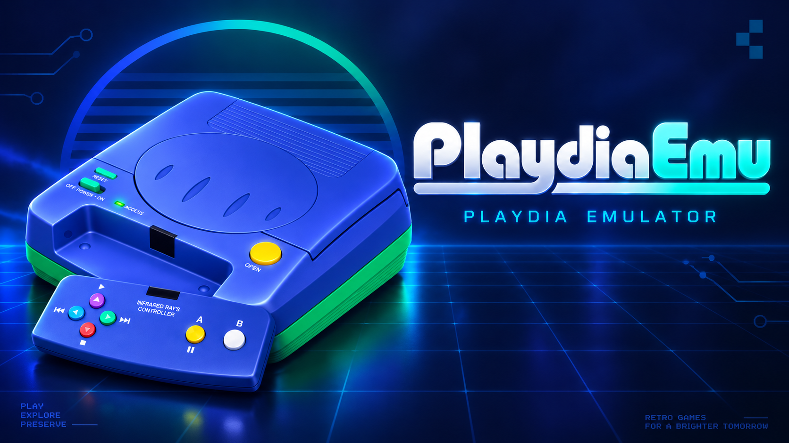

# PlaydiaEmu — A Bandai Playdia emulator written in Rust

<p align="center">
  
</p>

<p align="center">
  <a href="https://aloysHF.github.io/PlaydiaEmu/"></a>
  <a href="https://github.com/AloysHF/PlaydiaEmu/actions/workflows/ci.yml"></a>
  <a href="https://git.libretro.com/libretro/playdiaemu/-/pipelines"></a>
  <a href="https://github.com/AloysHF/PlaydiaEmu/releases/latest"></a>
  <a href="https://github.com/AloysHF/PlaydiaEmu/releases"></a>
  <a href="https://sonarcloud.io/dashboard?id=AloysHF_PlaydiaEmu"></a>
  <a href="LICENSE"></a>
  <a href="https://discord.gg/7XDdSrYD"></a>
  <a href="https://qm.qq.com/q/LAO7DKAWUC"></a>
</p>

Playdia is a 1990s Japanese interactive CD console from Bandai. Titles are
largely full-motion video driven by a CD-XA disc stream, with audio and video
decoded on a co-processor board. PlaydiaEmu is a Rust workspace that plays
real CDS-XA content through an HLE disc player (no BIOS required) and also
ships an SH-1 LLE shell for future firmware experiments.

## Status

Research-grade but usable for disc playback:

- **HLE disc player (recommended)** — dual-track MODE2 CUE/BIN streaming, F1/F2/F3 video markers, XA ADPCM audio
- **Interactive stream control** — finish embedded video before F2 jumps or button choices; unsupported command details remain under investigation
- **Video** — recovered AK8000 row/VLC decoding produces recognizable 248×216 game pictures in a 320×240 XRGB8888 framebuffer (eight bits per color channel); hardware pixel accuracy remains unverified
- **Audio** — Green Book CD-XA ADPCM, resampled to 44100 Hz stereo
- **SH-1 LLE shell** — interpreter subset + proven memory map; retail boot needs a user-supplied 512 KiB BIOS at `0xE0000000`
- **Headless machine** — deterministic `run_frame`, save states, diagnostics
- **Standalone CLI / window** — window / `--headless` HLE player
- **Libretro core** — RetroArch-compatible cdylib shell

## Features

- **CDS-XA Form 2 streaming** — 2352-byte Mode2 sectors, dual-track CUE/BIN
- **F1/F2/F3 routing** — video fragments including F2 overflow, F3 padding, and F2 scene navigation
- **XA ADPCM audio** — 4-bit ADPCM sound groups, 37800/18900 Hz → stereo 44100
- **Native game video** — 27 rows of 4×4 transform blocks, run/level coefficients, macroblock DC prediction and separate Y/C quantizers; invalid pictures preserve the previous frame
- **Save states** — content identity + CRC envelope; version 2 preserves RGB888 pixels (version 1 states are rejected)
- **Headless / inspect tooling** — sector and packet diagnostics without a window
- **RetroArch integration** — libretro core for frontend use
- **Cross-crate core** — platform-independent `playdiaemu-core` with no host I/O

## Usage

### Standalone Mode (HLE, no BIOS)

```powershell
cargo run --release -p playdiaemu -- path\to\game.cue --headless --frames 180
# Redump-style ZIP works too (CUE+BIN inside; no extract needed)
cargo run --release -p playdiaemu -- path\to\game.zip --headless --frames 180
```

For a reproducible button choice in headless playback, add for example
`--press-at 120:a` (zero-based host frame; repeat the option for more presses).

Windowed playback:

```powershell
cargo run --release -p playdiaemu -- path\to\game.cue
cargo run --release -p playdiaemu -- path\to\game.zip
```

See the [Standalone Emulator](docs/Standalone-Emulator.md) guide for
installation, keyboard controls, headless mode, screenshots/PPM dumps, and all
command-line options. Batch title-screen captures live in
`scripts/batch-screenshots.ps1`; the published matrix is
[Game Compatibility](docs/Game-Compatibility.md).

### RetroArch Mode

Build the libretro core and load a disc image through RetroArch's
**Load Content** menu. The core uses the same HLE disc player as the
standalone emulator (no BIOS). See [RetroArch Core](docs/RetroArch-Core.md)
for build, install (cdylib rename + `.info`), RetroPad mapping, features,
and limitations.

## Building

Requires [Rust](https://www.rust-lang.org/tools/install) (stable).

| Target | Command | Details |
|--------|---------|---------|
| Standalone (`playdia-emu`) | `cargo build --release -p playdiaemu` | Binary: `target/release/playdia-emu` (`.exe` on Windows). Full CLI, keys, headless: [Standalone Emulator](docs/Standalone-Emulator.md) |
| Libretro core | `cargo build --release -p playdiaemu-libretro` | Rename cdylib → `playdiaemu_libretro.<ext>` and install `.info`: [RetroArch Core](docs/RetroArch-Core.md) |

### Tools

```powershell
cargo run --release -p playdiaemu-tools --bin playdia-inspect -- path\to\game.cue
cargo run --release -p playdiaemu-tools --bin playdia-frame -- game.cue --packet 523 --output scene.ppm
```

Inspector flags (`--video-headers`, `--video-rows`, `--video-candidates`) and
`playdia-frame --check-all`: see [Standalone Emulator](docs/Standalone-Emulator.md).
Decoder facts: [AK8000 research](docs/AK8000-Research.md). A
[37-disc validation run](docs/AK8000-Corpus-Validation.md) measures entropy
coverage only — not full game compatibility or hardware pixel accuracy.

## Testing

Run the unit tests:

```powershell
cargo test --workspace
```

CI runs formatting, clippy, tests, and a release build on every push and pull
request (see `.github/workflows/ci.yml`). Prefer `--release` for any real-disc
decode or visual check; debug builds are for unit tests and fast iteration only.

## Architecture

```
crates/
├── playdiaemu-core/            # Platform-independent emulator engine (library)
│   └── src/
│       ├── lib.rs              # Crate root
│       ├── machine.rs          # LLE machine (SH-1 + bus + CDXA device)
│       ├── player.rs           # HLE DiscPlayer (Track 2 stream)
│       ├── sh1.rs              # SH-1 interpreter subset
│       ├── bus.rs              # Address space + diagnostics
│       ├── cd.rs               # Disc image / CUE/BIN helpers
│       ├── cdx.rs              # LLE CDXA device (shared MMIO window)
│       ├── content.rs          # Disc load (CUE/BIN, ZIP, raw/cooked) + demux types
│       ├── audio.rs            # XA ADPCM decode + resample
│       ├── video.rs            # F1 packet assembly / presentation path
│       ├── video/
│       │   ├── ak8000.rs       # Native AK8000 entropy / pixel decode
│       │   └── structure.rs    # Picture header, row markers, F1/F2 fragments
│       ├── bitstream.rs        # Bit reader
│       ├── ac_tables.rs        # Coefficient / VLC tables
│       ├── input.rs            # Button state
│       ├── state.rs            # Save-state envelope
│       └── diagnostics.rs      # Unmapped / unknown / budget counters
├── playdiaemu/                 # Standalone binary (→ playdia-emu)
│   └── src/
│       ├── main.rs             # Window + CLI (window / --headless)
│       ├── keyboard.rs         # Default keys + --remap
│       ├── gamepad.rs          # Physical gamepad (gilrs)
│       └── gamepad_overlay.rs  # On-screen button overlay
├── playdiaemu-libretro/        # libretro cdylib (→ playdiaemu_libretro.{dll,so,dylib})
│   ├── playdiaemu_libretro.info
│   └── src/
│       ├── lib.rs              # C ABI entry + core state
│       ├── api.rs              # retro_* implementation
│       ├── callbacks.rs        # Frontend callback storage
│       ├── constants.rs        # Timing, device IDs, performance level
│       ├── logger.rs           # log → RetroArch log bridge
│       └── types.rs            # libretro C types
└── playdiaemu-tools/           # Inspector and research utilities
    └── src/bin/
        ├── playdia_inspect.rs  # Sector / F1–F3 / audio counts
        ├── playdia_scan.rs     # Research scan helper
        └── playdia_frame.rs    # Decode one packet or --check-all
```

Standalone and the libretro core both drive the same HLE `DiscPlayer` (no
BIOS). Sector layout, video markers, and codec notes live in
[Game File Formats](docs/Game-File-Formats.md).

## Game Compatibility

For the detailed matrix, see [Game Compatibility](docs/Game-Compatibility.md).

## Contributing

Contributions are welcome — compatibility testing, codec research, SH-1
accuracy, docs, and bug reports. See [CONTRIBUTING.md](docs/CONTRIBUTING.md)
for details, code style, and the local CI checks.

## License

This project is licensed under the [BSD 3-Clause License](LICENSE).
