# Game Compatibility

HLE player (no BIOS). Counts below cover batch screenshots, deeper integration
checks, and structural entropy validation — not full playthroughs.

## Summary

| Status | Count |
|--------|-------|
| ✅ Batch screenshot (non-blank frame rendered) | 37 |
| HLE player integration checks (load + stream + video + audio) | 2 |
| Native entropy validation across complete disc streams | 37 |

## Batch screenshots (2026-09-16)

All 37 Redump ZIP titles completed `scripts/batch-screenshots.ps1` against the
release `playdia-emu` binary and wrote a non-blank PNG under `docs/images/`.
Capture uses 300 host frames (10 s at 30 fps) unless overridden: Aqua
Adventure 360 frames; Mari-nee no Heya and Sample Soft 180 frames; Dragon Ball
Z Chikyuu-hen 600 frames. Titles that hold on the BANDAI boot logo
(Chougoukin Selections, Gamera, Hello Kitty, both Nintama Rantarou discs) also
receive scripted `--press-at` A presses so the capture leaves the logo.
ZIPs are loaded in place (CUE+BIN inside the archive) — no extraction step.

These frames establish startup / early demo rendering only. They do not prove
navigation completeness, audio quality on host sinks, save data, full
playthrough, or hardware pixel accuracy. Two titles additionally have deeper
HLE player integration checks: Mari-nee no Heya (native title/button screen;
load, stream, video, audio) and Sample Soft (native menu and demo imagery;
load, stream, video, audio).

## Game List

| # | Title | Screenshot | Status |
|---|-------|------------|--------|
| 1 | Aqua Adventure - Blue Lilty (Japan) | 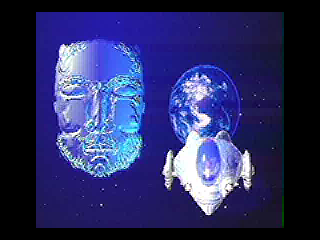 | ✅ Screenshot |
| 2 | Bandai Item Collection 70' (Japan) | 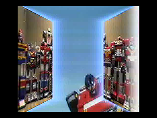 | ✅ Screenshot |
| 3 | Bishoujo Senshi Sailor Moon S - Quiz Taiketsu! Sailor Power Shuketsu!! (Japan) | 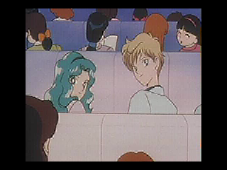 | ✅ Screenshot |
| 4 | Chougoukin Selections (Japan) | 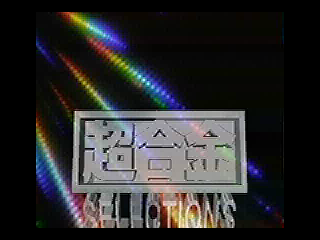 | ✅ Screenshot |
| 5 | Dragon Ball Z - Shin Saiyajin Zetsumetsu Keikaku - Chikyuu-hen (Japan) | 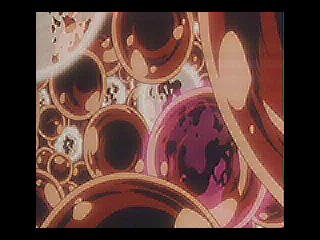 | ✅ Screenshot |
| 6 | Dragon Ball Z - Shin Saiyajin Zetsumetsu Keikaku - Uchuu-hen (Japan) | 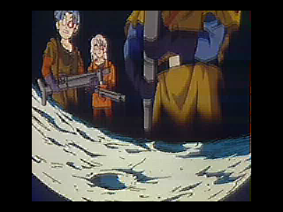 | ✅ Screenshot |
| 7 | Elements Voice Series - Aya Hisakawa - Forest Sways (Japan) | 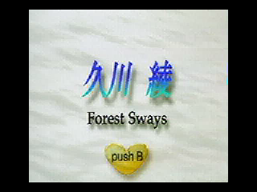 | ✅ Screenshot |
| 8 | Elements Voice Series - Mariko Kouda - Welcome to the Marikotown! (Japan) | 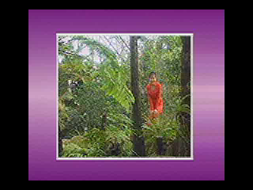 | ✅ Screenshot |
| 9 | Elements Voice Series - Mika Kanai - Wind & Breeze (Japan) | 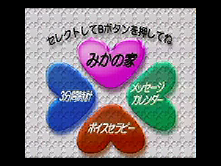 | ✅ Screenshot |
| 10 | Elements Voice Series - Rica Fukami - Private Step (Japan) | 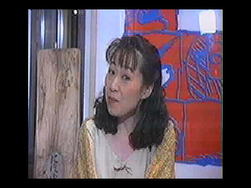 | ✅ Screenshot |
| 11 | Elements Voice Series - Yuri Shiratori - Rainbow Harmony (Japan) | 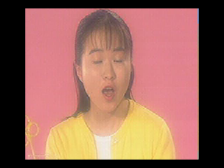 | ✅ Screenshot |
| 12 | Gamera - The Time Adventure (Japan) | 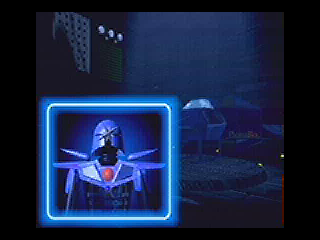 | ✅ Screenshot |
| 13 | Hello Kitty - Yume no Kuni Daiboken (Japan) | 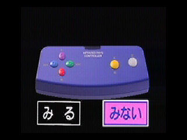 | ✅ Screenshot |
| 14 | Ie Naki Ko - Suzu no Sentaku (Japan) | 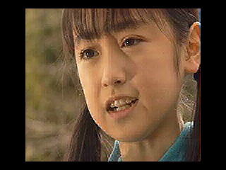 | ✅ Screenshot |
| 15 | Kero Kero Keroppi - Uki Uki Party Land!! (Japan) | 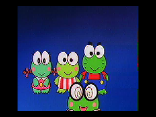 | ✅ Screenshot |
| 16 | Mari-nee no Heya (Japan) | 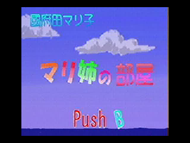 | ✅ Screenshot + HLE check |
| 17 | Newton Museum - Kyoryu Nendaiki Kohen (Japan) | 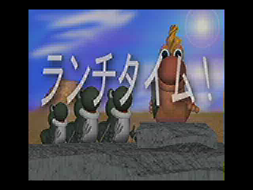 | ✅ Screenshot |
| 18 | Newton Museum - Kyoryu Nendaiki Zenpen (Japan) | 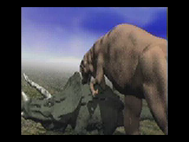 | ✅ Screenshot |
| 19 | Norimono Banzai!! Densha Daishuugou!! (Japan) | 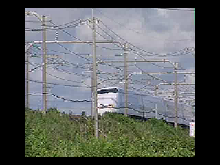 | ✅ Screenshot |
| 20 | Norimono Banzai!! Kuruma Daishuugou!! (Japan) | 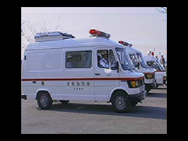 | ✅ Screenshot |
| 21 | Playdia - Quick Interactive System - Sample Soft (Japan) | 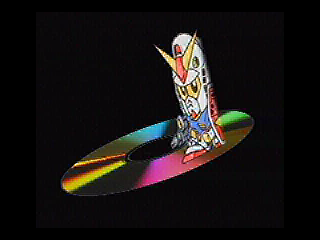 | ✅ Screenshot + HLE check |
| 22 | Playdia iQ Kids - Bishoujo Senshi Sailor Moon SuperS - Sailor Moon to Hajimete no Eigo (Japan) | 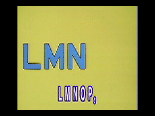 | ✅ Screenshot |
| 23 | Playdia iQ Kids - Bishoujo Senshi Sailor Moon SuperS - Sailor Moon to Hiragana Lesson! (Japan) | 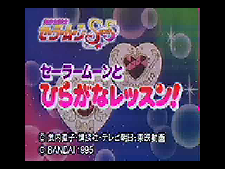 | ✅ Screenshot |
| 24 | Playdia iQ Kids - Bishoujo Senshi Sailor Moon SuperS - Youkoso! Sailor Youchien (Japan) | 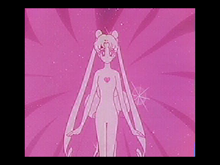 | ✅ Screenshot |
| 25 | Playdia iQ Kids - Nintama Rantarou - Gungun Nobiru Chinou-hen (Japan) | 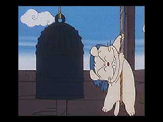 | ✅ Screenshot |
| 26 | Playdia iQ Kids - Nintama Rantarou - Hajimete Oboeru Chishiki-hen (Japan) | 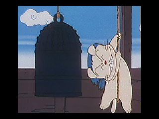 | ✅ Screenshot |
| 27 | Playdia iQ Kids - Soreike! Anpanman - Picnic de Obenkyou (Japan) | 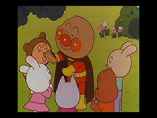 | ✅ Screenshot |
| 28 | Playdia iQ Kids - Ultraman - Chinou UP Daisakusen (Japan) | 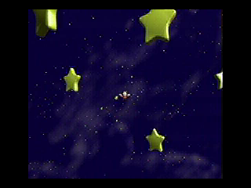 | ✅ Screenshot |
| 29 | Playdia iQ Kids - Ultraman - Hiragana Daisakusen (Japan) | 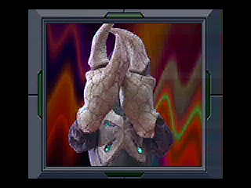 | ✅ Screenshot |
| 30 | Playdia iQ Kids - Ultraman - Oide yo! Ultra Youchien (Japan) | 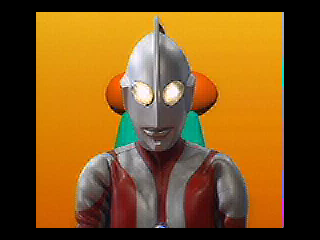 | ✅ Screenshot |
| 31 | Playdia iQ Kids - Ultraman - Suuji de Asobou Ultra Land (Japan) | 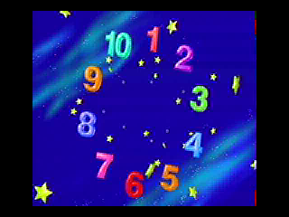 | ✅ Screenshot |
| 32 | SD Gundam - Daizukan (Japan) | 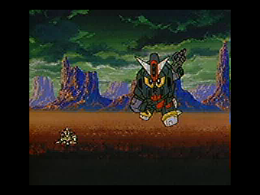 | ✅ Screenshot |
| 33 | Shuppatsu! Dobutsu Tankentai (Japan) | 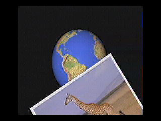 | ✅ Screenshot |
| 34 | Ultra Seven - Chikyuu Bouei Sakusen (Japan) | 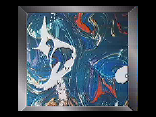 | ✅ Screenshot |
| 35 | Ultraman - Alphabet TV e Youkoso (Japan) | 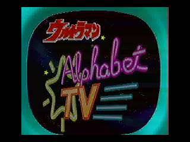 | ✅ Screenshot |
| 36 | Ultraman Powered - Kaiju Gekimetsu Sakusen (Japan) | 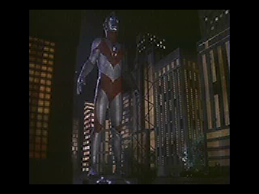 | ✅ Screenshot |
| 37 | Yumi to Tokoton Playdia (Japan) (Dokidoki Campaign) | 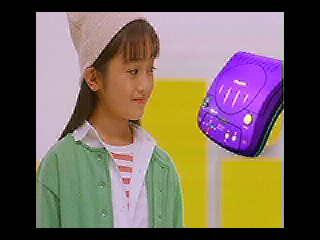 | ✅ Screenshot |

Legend:

| Symbol | Meaning |
|--------|---------|
| ✅ Screenshot | Batch capture produced a non-blank early frame (startup / title / demo). |
| ✅ Screenshot + HLE check | Screenshot plus load / stream / video / audio integration notes above. |
| ❌ Fail | Crash, timeout, or no usable screenshot. |

## How to update

Regenerate the published matrix (ZIPs in place; private path is not committed):

```powershell
.\scripts\batch-screenshots.ps1 -RedumpDir <local-redump-folder>
```

Inspect a title:

```powershell
cargo run --release -p playdiaemu-tools --bin playdia-inspect -- "path/to/title.cue"
```

Play headlessly and dump a frame:

```powershell
cargo run --release -p playdiaemu -- `
  "path/to/title.cue" `
  --headless --frames 120
```

Record:

1. Whether the CUE / ZIP loads
2. Stream track number and F1/F2/F3 / audio sector counts from `playdia-inspect`
3. Host frames run and whether the PPM / PNG is non-blank
4. Approximate PCM sample count from logs

## Notes

- Default video uses the recovered **248×216 AK8000 decoder**. Sample Soft,
  Dragon Ball Z and Mari-nee pictures are recognizable; this does not establish
  hardware pixel accuracy or full game compatibility. Use `playdia-frame
  --check-all` to measure entropy coverage separately from navigation.
- F2 jump and button-choice navigation is exercised on a private disc; timeout,
  quiz, and score semantics have not been verified on hardware.
- Prefer `--release` builds for any visual check.
- Do not commit discs, BIOS, or PPM dumps. Screenshots under `docs/images/`
  are PNG previews only.
